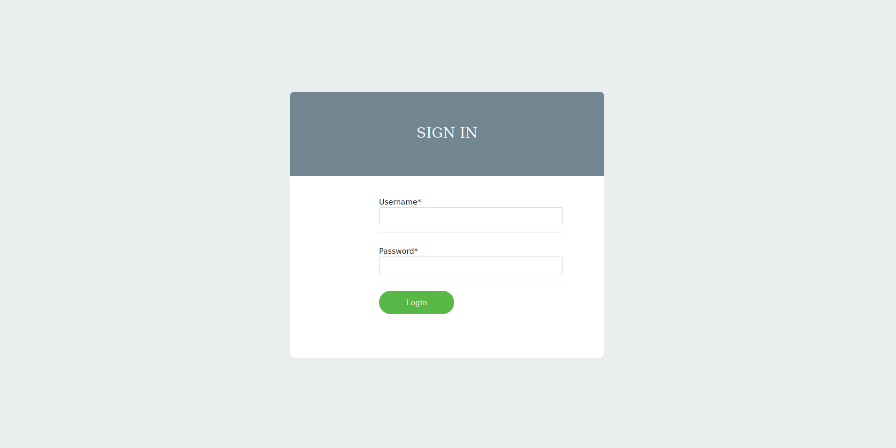
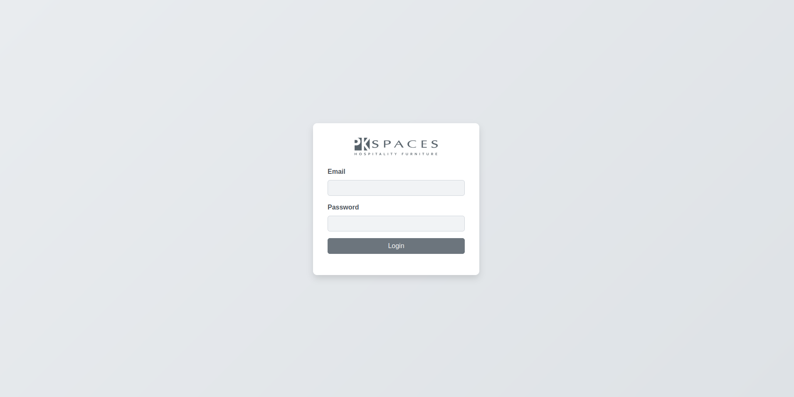

# Hotel Installation Bot - Development Guide

This guide provides instructions for setting up the Hotel Installation Bot project for local development.

## Overview

The project is a Django web application designed to assist with hotel furniture installation tracking. It includes an administrative interface for managing data (rooms, inventory, products, schedules) and an AI-powered chatbot interface to query project information using natural language.

## Prerequisites

Before you begin, ensure you have the following installed:

*   **Python** (3.11+ recommended)
*   **pip** (Python package installer)
*   **Git**
*   **PostgreSQL** (Database Server)

## Setup Instructions

1.  **Clone the Repository:**
    ```bash
    git clone https://github.com/karundhir89/hotel-installation-bot.git
    cd hotel-installation-bot
    ```

2.  **Set up Virtual Environment (Recommended):**
    ```bash
    python -m venv venv
    source venv/bin/activate 
    # On Windows use `venv\Scripts\activate`
    ```

3.  **Install Dependencies:**
    ```bash
    pip install -r requirements.txt
    ```
    *(Note: Ensure `requirements.txt` is up-to-date)*

4.  **Environment Variables:**
    *   Create a `.env` file in the following directory (`hotel-installation-bot/admin/admin/.env`).
    *   Copy the contents of `.env.example` and update credentials
    *   Fill in the required values for your local setup.

  
    ```

5.  **Database Setup:**
    *   Ensure your PostgreSQL server is running.
    *   Create the database specified in your `DATABASE_URL` if it doesn't exist.
    *   Run Django migrations:
        ```bash
        cd admin
        python manage.py migrate
        ```

## Running the Application

1.  **Start the Django Development Server:**
    ```bash
    python manage.py runserver
    ```
2.  Access the application in your browser, usually at `http://127.0.0.1:8000/`. Check `admin/urls.py` for specific admin or app URLs.

## Contribution Workflow (Branching Strategy)

All development **must** happen on feature branches based on the `dev` branch.

1.  **Ensure `dev` is up-to-date:**
    ```bash
    git checkout dev
    git pull origin dev
    ```

2.  **Create your feature branch:**
    Branches **must** follow the naming convention: `ticket_TICKETNUMBER_developername` (using snake_case for your name).
    ```bash
    # TICKETNUMBER will be of three digits
    # Replace TICKETNUMBER with the actual ticket/issue number
    # Replace developername with your name in snake_case (e.g., john_doe)
    git checkout -b ticket_123_jane_smith
    ```

3.  **Develop:** Make your code changes, commit frequently with clear messages.

4.  **Push your branch:**
    ```bash
    git push origin ticket_TICKETNUMBER_developername
    ```

5.  **Open a Pull Request:** Create a Pull Request on the Git hosting platform (e.g., GitHub, GitLab) from your feature branch into the `dev` branch.

## Key Technologies

*   Python / Django (Backend)
*   PostgreSQL
*   OpenAI API
*   HTML / CSS / JavaScript (Frontend) 

## Accessing the Application

Once the development server is running (usually at `http://127.0.0.1:8000`), you can access the following login pages:

*   **Admin/Superuser Login:** Navigate to `/admin/login/`
    *   Example URL: `http://127.0.0.1:8000/admin/login/`
    *   

*   **Normal User Login (Chatbot Interface):** Navigate to the root path `/`
    *   Example URL: `http://127.0.0.1:8000/user_login/`
    *   

*(Replace `http://127.0.0.1:8000` with your actual base URL if different)* 